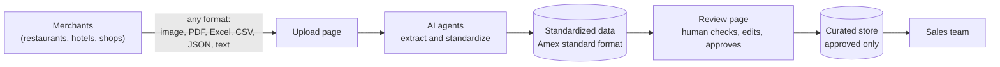

# Transaction Standardizer

Automatically turns merchant payment-transaction files (any format) into one standard format, then lets a human
verify and approve them in a browser.

> [!NOTE]
> **Read the docs:** open [`docs/site/index.html`](docs/site/index.html) in a browser (double-click after cloning). It is a
> Confluence-style space with a page tree, panels, tables and rendered flow charts, and works offline.
> The same pages as Markdown are in [docs/](docs/README.md). The working prototype is in [standardizer/](standardizer/).

## 60-second summary



## Run the prototype

```
git clone https://github.com/Sanjit-kumar/Amex.git
cd Amex/standardizer
python start.py        # Windows: double-click run.bat   |   Mac/Linux: ./start.sh
```

That installs what is missing, creates its own config, starts the server and opens the UI at http://localhost:8000.
Details: [docs/08-run-locally.md](docs/08-run-locally.md)
