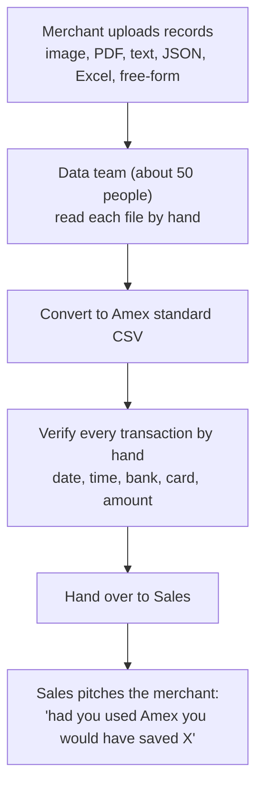
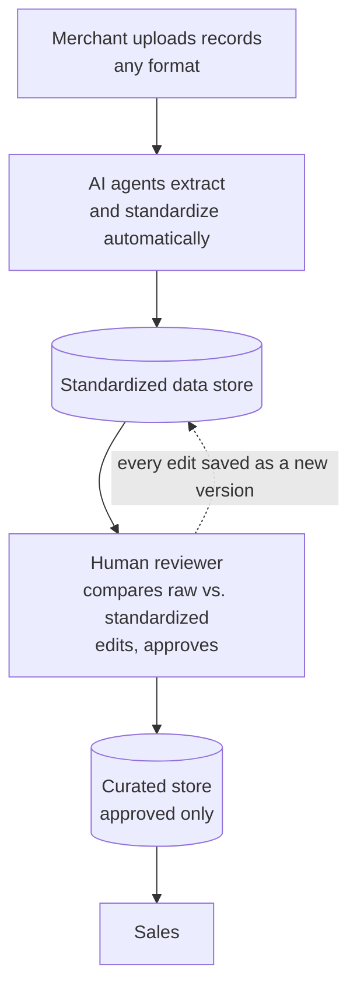

# 1. Problem and goals

[&larr; Home](README.md) &middot; Next: [Architecture &rarr;](02-architecture.md)

## Today (as-is)

Amex collects payment-transaction records from many kinds of businesses: restaurants, hotels, boutiques, florists.
They upload in any format and with any layout.

**Pain points**

- Large manual effort for work that is mostly reading and re-typing.
- Slow turnaround between a merchant upload and a usable record.
- Inconsistent conversion between people, and errors that are hard to trace.

## Target (to-be)

The manual conversion step disappears. One human check remains, so accuracy is controlled by a person, not assumed.

## Goals

- Accept any file format without per-merchant parsers.
- Produce one consistent standard record per transaction.
- Keep a human in the loop: nothing reaches sales unapproved.
- Show the raw file next to the standardized data so checking is fast.
- Keep a full audit trail: who changed what, and what the AI originally said.

## Non-goals (for now)

- Pitching or savings calculations. Sales still does this from the curated data.
- Real-time processing guarantees. Files are processed in the background.
- Replacing the human approval step.

## Success metrics (proposed)

| Metric | How to measure |
|---|---|
| Field-level accuracy of AI output | Compare v1 (AI) against the final approved version on a labeled test set |
| Share of records approved with no edits | Count records where approved version = version 1 |
| Reviewer time per record | Time from opening a record to approving it |
| Turnaround | Upload time to approved time |
| Manual effort removed | Reviewer headcount and hours vs. the current team |

> [!IMPORTANT]
> The most valuable early step is a **labeled test set**: 100 to 200 real merchant files with the correct standardized
> output, produced by the current team. It is how we compare models and prove accuracy. See
> [Roadmap](07-roadmap-and-open-questions.md).
