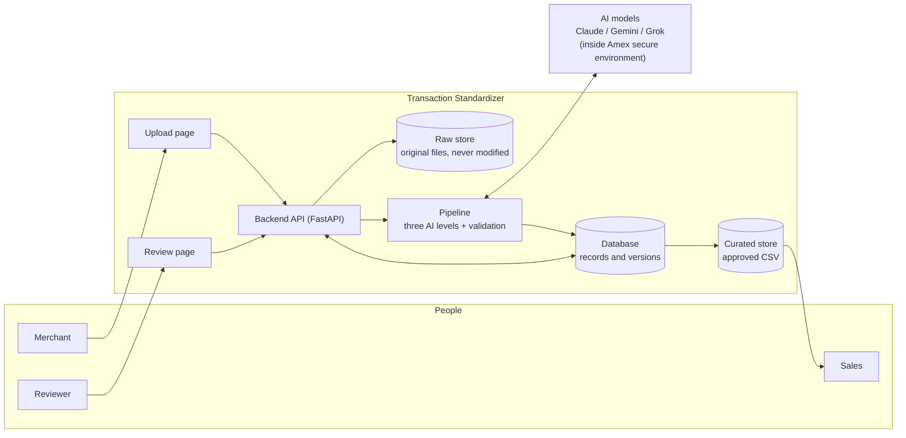
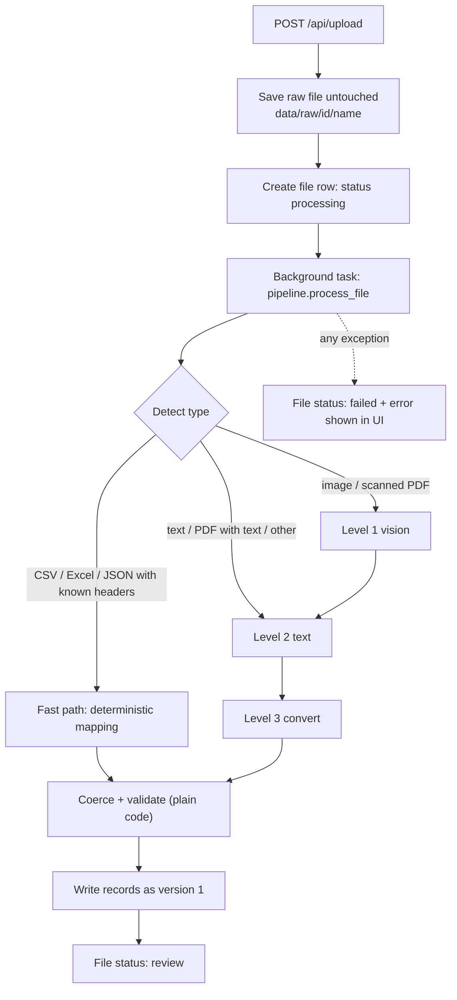

# 2. Architecture

[&larr; Problem and goals](01-problem-and-goals.md) &middot; [Home](README.md) &middot; Next: [AI pipeline &rarr;](03-pipeline.md)

## System context

## Components

| Component | File (in `standardizer/`) | Responsibility |
|---|---|---|
| Upload page | `static/index.html` | Drop files, show progress. No editing here |
| Review page | `static/review.html` | List all records, filter, bulk approve, side-by-side edit |
| Shared UI code | `static/common.js`, `style.css` | Header, user selector, API helper |
| Backend API | `app.py` | Upload, list, edit, approve/reject, bulk, export |
| Pipeline | `pipeline.py` | File-type detection, three AI levels, orchestration |
| AI clients | `llm.py` | One function per provider, uses the calling user's credentials |
| Mapping and coercion | `mapping.py` | Standard schema, alias table, date/amount/card normalization |
| Validation | `validators.py` | Deterministic checks. No AI |
| Storage | `storage.py` | Raw files, SQLite, versions, curated CSV |
| Config | `config.py`, `config.json` | Per-user credentials and which model runs each level |

## Request flow for an upload

## Technology choices

| Layer | Prototype | Why | Production candidate |
|---|---|---|---|
| Backend | Python, FastAPI | Best AI and document-processing libraries | Same |
| Frontend | Plain HTML + JavaScript, no build step | Runs with zero setup, easy to read | React + TypeScript if the UI grows |
| Database | SQLite | Zero setup | PostgreSQL |
| Raw files | Local folder | Zero setup | S3 / GCS with object lock (immutable) |
| Queue | FastAPI background task | Simple | SQS / Pub/Sub with retries |
| Identity | User dropdown | Prototype only | Amex SSO |
| AI access | Local Claude Code CLI, or API keys | Local testing | Approved model endpoints per user |

> [!WARNING]
> Several prototype choices are deliberately simple and **must be replaced** for production: the user dropdown (no
> authentication), SQLite, in-process background tasks (lost on restart), and plaintext keys in `config.json`.
> See [Configuration and security](06-config-security.md).

## Design decisions

| Decision | Reasoning |
|---|---|
| Validation is plain code, not AI | It decides what a human must look at, so it has to be deterministic and explainable |
| Structured files skip the AI | Mapping known headers in code is exact, instant and free. Most volume is probably structured |
| Raw files are never modified | Reviewers and auditors can always see exactly what the merchant sent |
| Edits create versions, never overwrites | Keeps the AI original (v1) for accuracy measurement and an audit trail |
| UI and access control are not agents | Login, roles and the approve button must be predictable |
| Provider per level is configuration | Models can be swapped after benchmarking without code changes |
