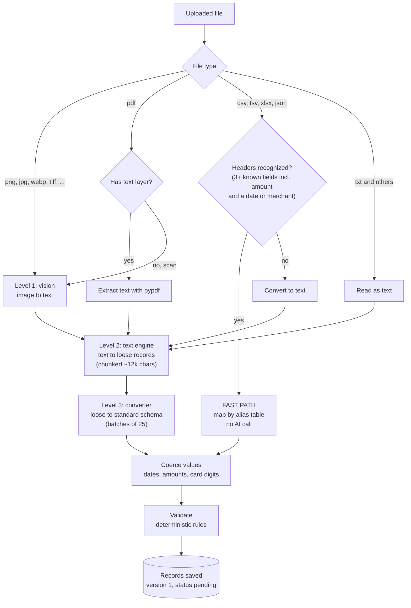
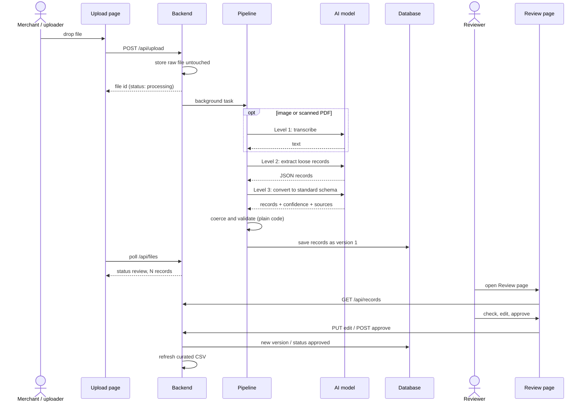

# 3. AI pipeline

[&larr; Architecture](02-architecture.md) &middot; [Home](README.md) &middot; Next: [Data model &rarr;](04-data-model.md)

Source: [`standardizer/pipeline.py`](../standardizer/pipeline.py)

## The three levels

| Level | Default model | Input | Output |
|---|---|---|---|
| **1. Vision** | Gemini (configurable) | Images, scanned PDFs | Faithful text transcription of the document |
| **2. Text** | Claude (configurable) | Any text, from any source | A list of loose records, using the source's own labels |
| **3. Convert** | Grok (configurable) | Loose records | Standard-schema records, plus a confidence and a source snippet for every field |

Each level's provider and model is set in `config.json` under `stages`. They can all be the same model.

## Why a fast path

CSV, Excel and JSON files whose column names we recognise (for example `Merchant`, `Date`, `Total`, `Card`) are
mapped by an alias table in [`mapping.py`](../standardizer/mapping.py). That is exact, instant and costs nothing.
Only files that need interpretation use the AI.

> [!NOTE]
> The alias table is a plain dictionary. Adding a merchant's unusual column name is a one-line change.

## What one upload looks like

## Prompts

The prompts live in [`pipeline.py`](../standardizer/pipeline.py) as `VISION_PROMPT`, `TEXT_PROMPT`, `CONVERT_PROMPT`.

- **Vision** asks for a faithful transcription and explicitly forbids summarizing or correcting.
- **Text** asks for every transaction as a JSON array, keeping the source's own keys and not normalizing values.
- **Convert** supplies the standard schema and asks for `{data, confidence, source}` per record, with null for
  anything not present. It must never output a full card number.

## Behaviors worth knowing

| Behavior | Detail |
|---|---|
| Missing data is not guessed | If a receipt has no date or merchant name, the field stays empty and is flagged as a required-field error |
| Full card numbers | Only the last 4 digits are kept in standardized data. A Luhn check runs on a full number if one is present |
| Ambiguous dates | `03/04/2026` could be 3 April or 4 March. Deterministic parsing flags this. Dates the AI already converted to ISO lose that flag (known gap) |
| Large files | Text is split into ~12,000-character chunks for Level 2, and records are converted in batches of 25 |
| Count mismatch | If Level 3 returns a different number of records than it was given, the file fails rather than saving misaligned data |
| Failure | Any exception sets the file to `failed`, logs the reason, and the Upload page offers Retry |
| Retry limits | A file with any approved or rejected record cannot be reprocessed |

## Providers

[`llm.py`](../standardizer/llm.py) has one function per provider behind `complete(provider, key, model, prompt, files)`.

| Provider id | How it calls | Credential |
|---|---|---|
| `claude` | Anthropic Messages API, images and PDFs as content blocks | User's API key |
| `gemini` | Google `generateContent`, files as inline data | User's API key |
| `grok` | xAI chat completions (OpenAI-compatible) | User's API key |
| `claude_code` | Local `claude -p` CLI, files read via its Read tool | The machine's Claude Code login |

> [!WARNING]
> The `claude`, `gemini` and `grok` clients follow each vendor's documented REST API but have **not yet been run
> against live keys**. Only `claude_code` has been exercised end to end. Expect to adjust model names and details
> when real endpoints are connected.
