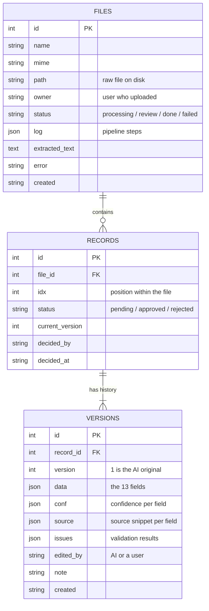
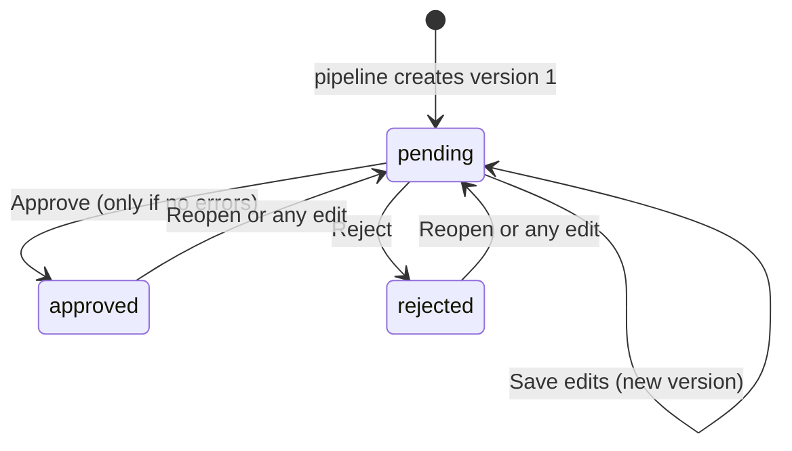
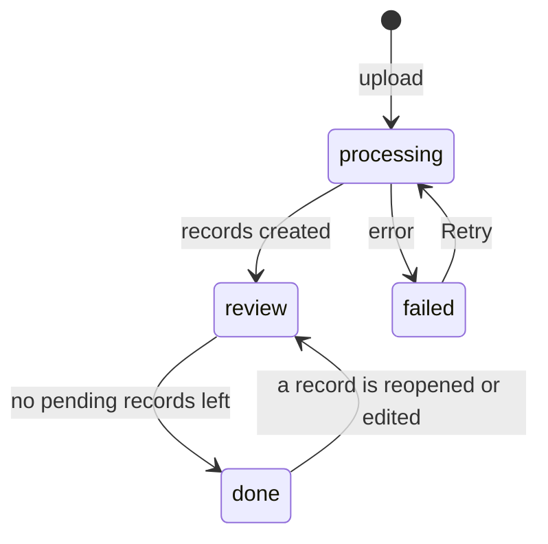

# 4. Data model and validation

[&larr; AI pipeline](03-pipeline.md) &middot; [Home](README.md) &middot; Next: [Review UI &rarr;](05-review-ui.md)

Sources: [`mapping.py`](../standardizer/mapping.py), [`validators.py`](../standardizer/validators.py),
[`storage.py`](../standardizer/storage.py)

## Standard schema

Every transaction becomes one record with these 13 fields. A field with no data is stored as empty, never guessed.

| Field | Type / format | Required | Notes |
|---|---|---|---|
| `transaction_id` | string | no | Receipt, invoice or transaction number |
| `merchant_name` | string | **yes** | |
| `merchant_category` | string | no | For example restaurant, hotel, florist. Often inferred, so usually lower confidence |
| `transaction_date` | `YYYY-MM-DD` | **yes** | |
| `transaction_time` | `HH:MM:SS` (24h) | no | |
| `amount` | number | **yes** | Negative for refunds. Parentheses, `CR` and `refund` are read as negative |
| `currency` | ISO 4217, for example `USD` | **yes** | Inferred from a symbol such as `$` when absent, at lower confidence |
| `card_network` | Visa, Mastercard, Amex, Discover, other | no | Detected from the card number prefix when a full number is present |
| `card_last4` | 4 digits | warn if missing | Full card numbers are never stored in standardized data |
| `bank_name` | string | no | |
| `payment_method` | credit, debit, cash, other | no | |
| `description` | string | no | |
| `reference` | string | no | Authorization code or order number |

Besides the 13 fields, each record carries a **confidence** (0 to 1) and a **source snippet** per field. The source
snippet is the exact text the value came from, and it powers the highlight in the Review page.

## Entities

## Versioning

- Version 1 is written by the pipeline with `edited_by = AI`. It is never changed.
- Each human edit adds a new version with the editor's name. The record's `current_version` points to the latest.
- Editing an approved or rejected record sends it **back to pending** so it must be approved again.
- Comparing v1 with the approved version gives the accuracy metric described in
  [Problem and goals](01-problem-and-goals.md#success-metrics-proposed).

## Status lifecycles

**Record**

**File**

## Validation rules

All rules run in plain code, on AI output and again on every human edit, so an edit cannot bypass a check.

| Severity | Rule |
|---|---|
| **Error** (blocks approval) | `merchant_name`, `transaction_date`, `amount` or `currency` is missing |
| **Error** | Date is not `YYYY-MM-DD` after normalization |
| **Error** | Amount is not a number |
| **Error** | Currency is not a 3-letter code |
| **Error** | `card_last4` is present but not exactly 4 digits |
| Warning | Date is in the future or before the year 2000 |
| Warning | Amount is zero or above 100,000 |
| Warning | `card_last4` is missing |
| Warning | Time is not `HH:MM:SS` |
| Warning | Any field with extraction confidence below 0.70 |
| Warning | Possible duplicate: same merchant, date, amount and card within the same file |
| Warning | Ambiguous day/month order in a slash date |
| Info | A full card number was found in the source and reduced to the last 4 digits |
| Warning | A full card number failed the Luhn check |

Records with errors cannot be approved, individually or in bulk. Bulk approve skips them and reports how many.
