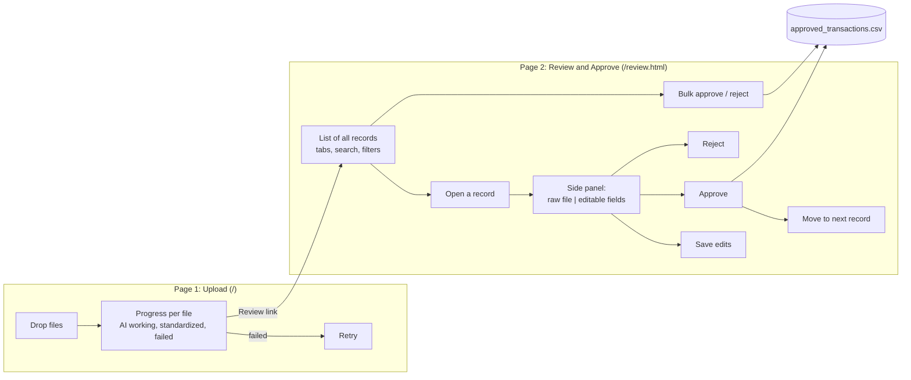
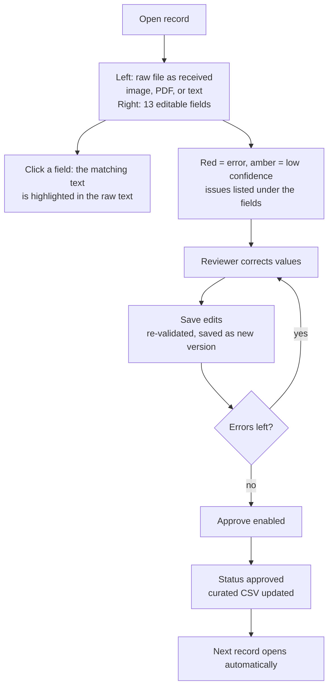

# 5. Review UI

[&larr; Data model](04-data-model.md) &middot; [Home](README.md) &middot; Next: [Configuration and security &rarr;](06-config-security.md)

The UI is two separate browser pages with distinct jobs.

## Page 1: Upload

- Drag and drop or click to choose. Several files at once is fine.
- Shows each file with a live status. While running it shows the current step, for example "L2 text: ...".
- Nothing to edit here. Work on the file continues automatically in the background, about 15 to 60 seconds per file
  with the local Claude Code CLI.
- A failed file shows the reason and a **Retry** button.

## Page 2: Review and Approve

**List**

| Feature | Detail |
|---|---|
| Tabs | Needs review, Approved, Rejected, All, each with a count. The nav badge shows the pending count |
| Columns | Status, merchant, date, time, amount and currency, card, checks (errors, warnings, clean), source file |
| Search | Merchant, file name, card digits, transaction id, description |
| Filter | Only records without errors |
| Bulk actions | Tick rows, then Approve selected or Reject selected. Records with errors are skipped and reported |

**Side panel (click a row)**

- **Prev / Next** walk the current list. **Esc** closes the panel.
- **History** shows every version with who changed what, for example `merchant_name: Foo -> Foo LLC`.
- Approving a record with errors is blocked in the UI and also rejected by the server.

## Output

Approved records are written to `standardizer/data/curated/approved_transactions.csv` every time an approval or edit
changes. The **Export approved CSV** button downloads the same file. Columns: record id, source file, the 13 standard
fields, approved by, approved at.

## Known limits of the UI

- Field-to-source highlighting works for text. For images there is no bounding-box overlay yet, because that needs the
  vision model to return coordinates.
- The highlight finds the first matching text, so a repeated value such as `USD` may highlight the wrong place.
- Identity is a dropdown. See [Configuration and security](06-config-security.md).
