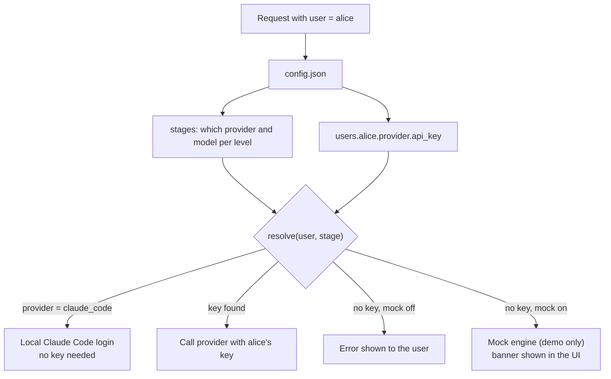

# 6. Configuration and security

[&larr; Review UI](05-review-ui.md) &middot; [Home](README.md) &middot; Next: [Roadmap and open questions &rarr;](07-roadmap-and-open-questions.md)

Source: [`standardizer/config.py`](../standardizer/config.py), `standardizer/config.example.json`

## Per-user AI credentials

Whoever is using the tool uses **their own** AI access. The user chosen in the UI is sent with every request, and the
pipeline resolves that user's credentials for each level.



`config.json` shape:

```json
{
  "stages": {
    "vision":  { "provider": "gemini",  "model": "..." },
    "text":    { "provider": "claude",  "model": "..." },
    "convert": { "provider": "grok",    "model": "..." }
  },
  "mock_when_no_key": false,
  "users": {
    "alice": {
      "gemini": { "api_key": "env:GEMINI_API_KEY" },
      "claude": { "api_key": "env:ANTHROPIC_API_KEY" },
      "grok":   { "api_key": "env:XAI_API_KEY" }
    }
  }
}
```

- A key is either a literal string or `env:VAR_NAME` to read an environment variable.
- The file is re-read on every request, so edits apply without a restart. Environment variables are read from the
  server process, so changing one needs a restart.
- `config.json` is **gitignored**. Copy `config.example.json` to create yours.
- Set `mock_when_no_key` to `false` in any real use. Mock output is not real AI output.
- Model names in the example are placeholders. Use whatever your approved endpoints expose.

## Data sensitivity

These files contain card details, banks and amounts.

| Concern | Current behavior | Production recommendation |
|---|---|---|
| Model access | Assumed to run entirely inside the Amex secure environment | Use only approved endpoints. Confirm which of Claude, Gemini and Grok are approved there |
| Full card numbers | Standardized data keeps only the last 4 digits. The **raw file is stored as received** and may still contain a full number | Mask or tokenize before the model call and restrict access to raw files |
| Secrets | API keys in plaintext in `config.json`, or environment variables | Secrets manager. Never commit keys |
| Identity | A user dropdown. **No authentication** | Replace `current_user()` in `app.py` with Amex SSO and roles |
| Audit | Every version records who edited and when. Every approval records who and when | Ship these records to the central audit system |
| Raw file integrity | Written once, never modified by the app | Object storage with write-once (object lock) |
| Access | Anyone who can open the page can approve | Roles: uploader, reviewer, approver, admin |

> [!CAUTION]
> The prototype has no authentication and must not be exposed on a network as is. It is meant for local testing.

## Local testing with Claude Code

For local development the provider `claude_code` shells out to `claude -p`, using the developer's Claude Code login so
no API key is needed. It is slower (each level is a separate CLI call) and counts against that subscription's usage.
Switch a stage to `claude`, `gemini` or `grok` to use API keys instead.
