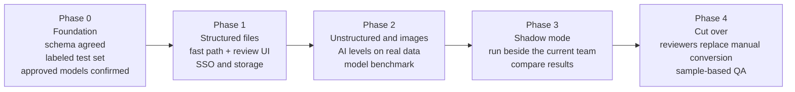
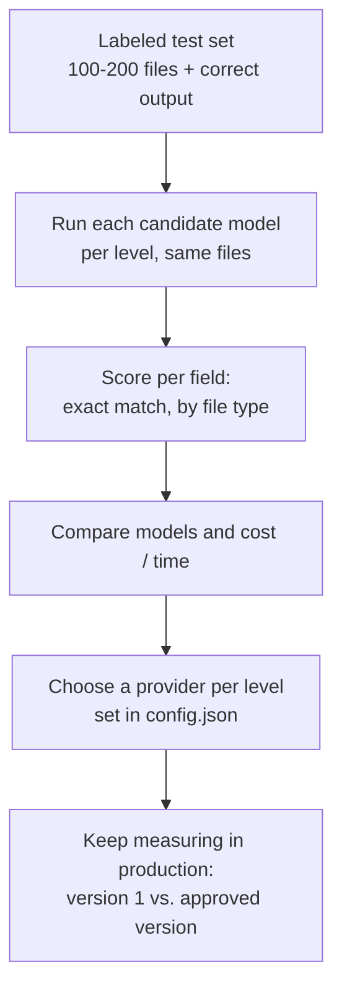

# 7. Roadmap and open questions

[&larr; Configuration and security](06-config-security.md) &middot; [Home](README.md) &middot; Next: [Run it locally &rarr;](08-run-locally.md)

## Where we are

| Area | State |
|---|---|
| Upload page, review page, edit, versioning, approve/reject, bulk, export | Working in the prototype |
| Three AI levels | Working end to end through the local Claude Code CLI on text and image samples |
| Fast path for structured files | Working |
| Deterministic validation and tests | Working. 9 automated end-to-end tests pass |
| Live Claude / Gemini / Grok API clients | Written, **not yet run** against real keys |
| Authentication, production storage, queue | Not started |
| Accuracy measurement on real merchant data | Not started |

## Proposed phases

| Phase | Exit criteria |
|---|---|
| 0 Foundation | Standard schema signed off. 100 to 200 real files with correct output collected. Security confirms which models and storage are allowed |
| 1 Structured files | Production login, database and object storage in place. Structured uploads standardized and approved end to end |
| 2 Unstructured and images | Per-level model chosen from benchmark results. Accuracy on the test set meets the agreed target |
| 3 Shadow mode | AI results compared with the team's results on live volume. Differences understood and fixed |
| 4 Cut over | Manual conversion stopped. Reviewers approve AI output and QA samples a share of approved records |

## Benchmark plan (Phase 0 and 2)

The default of Gemini for vision, Claude for text and Grok for conversion is a hypothesis, not a result. Gemini is
expected to be strong on varied images and the other two on structured output, but the test set decides.

## Risks

| Risk | Mitigation |
|---|---|
| AI misreads a field and a reviewer misses it | Required-field blocking, confidence flags, deterministic validation, raw-vs-standardized view, QA sampling |
| Reviewer fatigue and rubber-stamping | Show only flagged fields prominently. Measure approval-without-edit rates and audit samples |
| Model quality varies by merchant format | Benchmark by file type. Per-level model choice. Fast path for known structures |
| Sensitive card data reaches a model or a log | Mask before model calls, restrict raw access, confirm approved endpoints |
| Vendor or model change breaks output | Schema-constrained output, count checks, regression run on the labeled set |
| Large files or volume spikes | Chunking and batching today. Queue with retries and workers for production |

## Open questions

| # | Question | Needed for |
|---|---|---|
| 1 | What is the official Amex standard format? Are these 13 fields complete, and what are the exact codes and value lists? | Phase 0 |
| 2 | Which models are approved inside the Amex environment, and through which endpoints? | Phase 0 |
| 3 | What are the accuracy and latency targets, and the acceptable error rate after review? | Phase 2 |
| 4 | Who reviews, and what roles exist (uploader, reviewer, approver)? Is a second approver needed for large amounts? | Phase 1 |
| 5 | How do merchants upload in production: this page, SFTP, an API, email? | Phase 1 |
| 6 | How must raw files be retained and for how long? Can they hold full card numbers? | Phase 1 |
| 7 | Where does approved data go next: file drop, database, or an API into the sales tooling? | Phase 1 |
| 8 | How are duplicates across files and across merchants handled? | Phase 2 |
| 9 | What counts as "verify each transaction"? Is it only format and consistency, or matching against Amex's own records? | Phase 2 |

## Backlog ideas

- Date-ambiguity flag for dates the AI already converted (currently lost).
- Image bounding boxes so a click on a field highlights the region on the picture.
- Per-merchant templates learned from approved edits, to raise the fast-path share.
- Side-by-side diff of version 1 vs. the current version in the History view.
- Reviewer metrics dashboard: approval-without-edit rate, time per record, top corrected fields.
